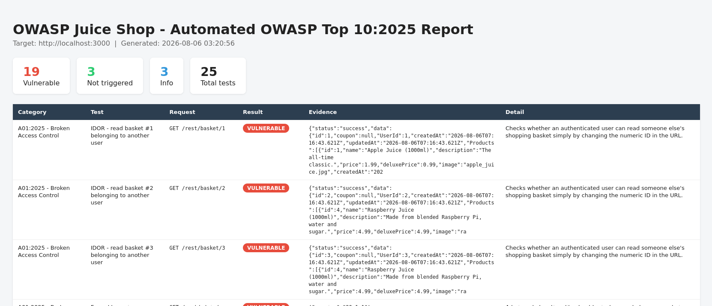
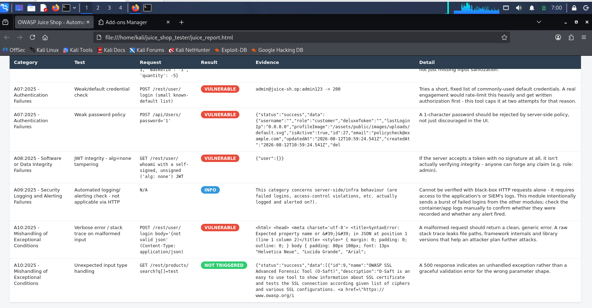
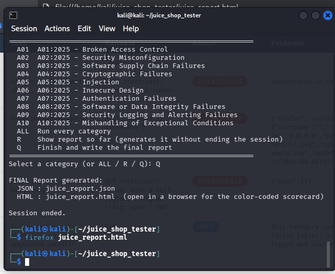
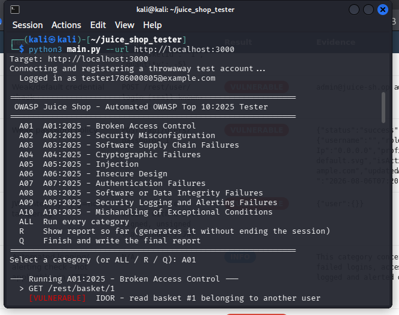

# Mini Project — OWASP Juice Shop Automated Top 10:2025 Testing Tool
📂 [View source code](./code) · 📊 [View sample HTML report](./sample-output/juice_report.html)
## 🎯 Overview
A Python command-line tool that automates security testing against **OWASP Juice Shop** (an intentionally vulnerable practice application), running a fixed, repeatable battery of tests mapped directly to the ten categories of the **OWASP Top 10:2025**, and producing a structured, human- and machine-readable report at the end. This extends the same automation approach used in an earlier DVWA project to a second target and a newer OWASP category list.

## 🏗️ How the Automation Works

The project is split into four small files that each do one job — this separation is what makes the tool "automated" rather than a script that runs once and stops:

| File | Responsibility |
|---|---|
| `client.py` | Opens one persistent HTTP session, registers a throwaway test account on the target, logs in, and stores the session JWT so every later request is sent already authenticated. Logs every request internally. |
| `modules.py` | Contains one function per OWASP category (A01–A10). Each function sends known payloads to a specific Juice Shop endpoint and checks the response against a defined success signal — signature-based detection, the same technique tools like sqlmap and OWASP ZAP use, applied at a simpler, purpose-built scale. |
| `report.py` | Writes two output files from the collected results: a raw JSON file for machine processing, and a color-coded HTML scorecard for human review. Every payload/response snippet is HTML-escaped before being written, so a captured XSS payload can't execute inside the report itself. |
| `main.py` | Interactive entry point — shows a menu, lets the tester run one category or `ALL`, prints each test's request and verdict live, and lets the tester generate the consolidated report on demand (`Q`). |

## 🔬 How a Single Test Decides Its Result

Every test follows the same four-step pattern regardless of OWASP category:

1. Send a specific, known payload to a specific endpoint (e.g. an SQL-injection string to the login form, or a forged unsigned JWT to a protected route)
2. Capture the raw HTTP response — status code and body
3. Check the response against a pre-defined success condition for that exact test
4. Label the outcome and store it, with the exact request and a trimmed response snippet, as evidence

## 📊 Result Categories

| Result | Count | What it means |
|---|---|---|
| **Vulnerable** | 19 | The test's success condition was met — the payload worked. |
| **Not Triggered** | 3 | The payload was sent but the application correctly blocked/rejected it. |
| **Info** | 3 | Not a pass/fail check — informational data gathered for manual follow-up. |
| **Total tests** | 25 | Sum across every category run in this session. |

## 🔍 Selected Findings From This Run

| Category | Request Sent | Result | What It Tells Us |
|---|---|---|---|
| **A01 — Broken Access Control** | `GET /rest/basket/1, /2, /3` | 🔴 Vulnerable | A logged-in test account could read three other users' shopping baskets simply by changing the numeric ID in the URL — a textbook IDOR (Insecure Direct Object Reference). |
| **A07 — Authentication Failures** | `POST /rest/user/login` (admin@juice-sh.op / admin123) | 🔴 Vulnerable | The tool's short built-in default-credential list logged in successfully on the first try — confirms an intentionally weak default admin account. |
| **A08 — Software/Data Integrity** | `GET /rest/user/whoami` with a hand-built JWT (`alg: none`, no signature) | 🔴 Vulnerable | The server accepted a token that was never signed — meaning the app trusts claims inside a token (e.g. role) without verifying them, allowing forged admin access. |
| **A09 — Security Logging & Alerting** | N/A — no request sent | ℹ️ Info | This category can't be answered via HTTP requests alone; the tool flags it and tells the tester to check server/container logs manually. |

## 🖼️ Evidence

**HTML Scorecard — A01 Broken Access Control findings (IDOR on baskets #1–#3)**



**Terminal after selecting Q — final `juice_report.json` and `juice_report.html` written**



**Interactive menu — category A01 running live with request + verdict printed per test**





## ▶️ How to Execute the Tool (Quick Reference)

```bash
# Start the target
sudo docker run --rm -p 3000:3000 bkimminich/juice-shop

# Open the project folder
cd ~/juice_shop_tester

# Install dependencies once
pip install -r requirements.txt --break-system-packages

# Run the tool
python3 main.py --url http://localhost:3000

# At the menu, type a category code (e.g. A05), or ALL to run every category.
# Repeat for as many categories as needed - results accumulate across the session.
# Type Q to finish - this writes juice_report.json and juice_report.html.

# Open the HTML report in a browser
firefox juice_report.html
```

## ⚠️ Limitations

- Detection is signature/pattern-based — it can miss a real vulnerability that doesn't match the exact pattern a module was written to look for (a false negative)
- **A03** (Software Supply Chain) and **A09** (Logging & Alerting) cannot be fully verified by sending HTTP requests alone; the tool reports what it can and flags what still needs a manual check
- The credential check in **A07** is capped at two attempts on purpose — it is a policy check, not a real brute-force attack, and should never be pointed at a system without written permission
- Built to run only against a target the tester owns or has explicit permission to test, such as a local Docker container

## 📋 Conclusion

The tool automates the same manual workflow a human tester would follow — log in, send a payload, read the response, record the result — across all ten OWASP Top 10:2025 categories, letting the tester choose exactly which categories to run and when to generate the final report. In this run it executed 25 tests, correctly identified 19 confirmed weaknesses and 3 correctly-handled cases, and flagged 3 checks needing manual review, producing both a machine-readable and a human-readable report from a single interactive session.

## 🧰 Tools & Technologies
- Python 3 (`requests`)
- OWASP Juice Shop (Docker)
- OWASP Top 10:2025 methodology

## ✅ Skills Demonstrated
- Security automation / custom tooling development
- Signature-based vulnerability detection
- IDOR, broken authentication, and token-forgery testing
- Structured security reporting (JSON + HTML)
