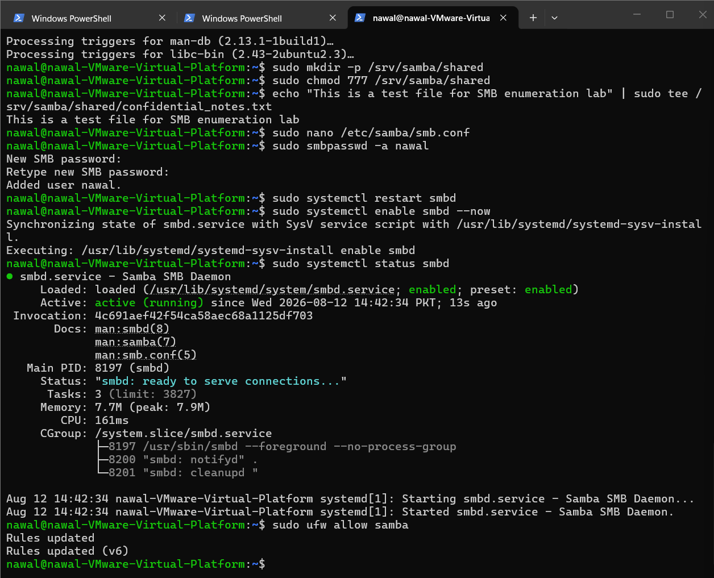
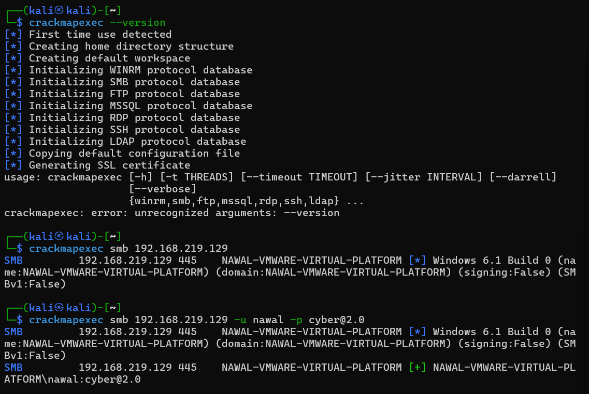
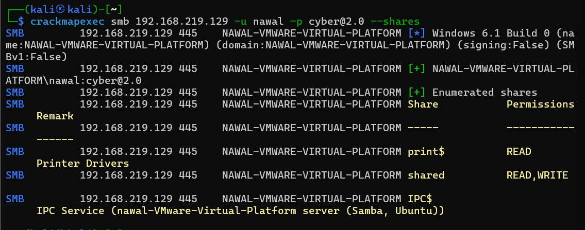
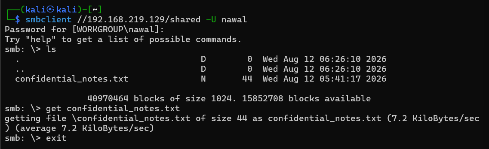

# Day 3 — CrackMapExec: SMB Enumeration & Access

## 🎯 Objective
Set up an SMB service on the target, then use CrackMapExec to enumerate hosts, validate credentials, discover shares, and access files — simulating a network/file-share reconnaissance phase of an internal penetration test.

## 🧪 Lab Setup
- **Attacker:** Kali Linux — `192.168.219.128`
- **Target:** Ubuntu Server — `192.168.219.129`

## Step 1 — Configure SMB Service on Target

Since the lab target does not run SMB by default, Samba was installed and configured to simulate a realistic internal network file share.

    sudo apt install samba -y
    sudo mkdir -p /srv/samba/shared
    sudo chmod 777 /srv/samba/shared
    sudo smbpasswd -a nawal
    sudo systemctl restart smbd
    sudo systemctl enable smbd --now
    sudo ufw allow samba

## Step 2 — SMB Enumeration & Credential Validation with CrackMapExec

    crackmapexec smb 192.168.219.129
    crackmapexec smb 192.168.219.129 -u nawal -p cyber@2.0

**Result:** CrackMapExec fingerprinted the host and successfully authenticated using previously discovered credentials.

## Step 3 — Share Enumeration

    crackmapexec smb 192.168.219.129 -u nawal -p cyber@2.0 --shares

**Result:** Discovered three shares — `print$` (READ), `shared` (READ,WRITE), and `IPC$`. The `shared` share's write permission indicates a potential misconfiguration allowing unauthorized read/write access.

## Step 4 — Accessing the Share

    smbclient //192.168.219.129/shared -U nawal
    ls
    get confidential_notes.txt

**Result:** Successfully connected to the share and downloaded a file, demonstrating that discovered credentials combined with a misconfigured share can lead directly to data access/exfiltration.

## 📋 Finding
The SMB share `shared` was configured with `READ,WRITE` permissions for an authenticated user. Combined with previously compromised credentials, this allowed full read and write access to file share contents — demonstrating how weak credential hygiene compounds with share misconfigurations to enable data exfiltration.

## 🧰 Tools Used
- Samba (target-side SMB service)
- CrackMapExec (`crackmapexec smb`)
- smbclient

## ✅ Skills Demonstrated
- SMB service enumeration
- Credential validation over SMB
- Share enumeration and permission analysis
- File access/exfiltration via smbclient
